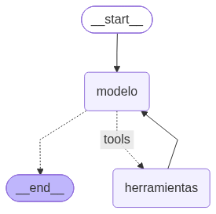

# Pre-entrega 5 · Agente de razonamiento cíclico con memoria persistente

Agente **ReAct** en LangGraph que ayuda a seguir **postulaciones laborales**. Decide solo cuándo usar sus
herramientas, reintenta si una herramienta devuelve un error, y **recuerda la conversación** por `thread_id`
gracias a un checkpointer SQLite. Los datos son **simulados** (`datos_simulados.py`).



## Consigna (checklist oficial)

- [x] Repo público sin API keys (variables de entorno) y README de cómo levantar el entorno
- [x] `StateGraph` cuyo estado hereda de `MessagesState`, con nodo de modelo + nodo de herramientas y arista condicional `tools_condition`
- [x] Herramientas propias con `@tool`, docstrings descriptivos y entrada validada con Pydantic (`args_schema`)
- [x] LLM vinculado con `llm.bind_tools()`
- [x] Persistencia con SqliteSaver (versión async: `AsyncSqliteSaver`) + `thread_id`
- [x] Razonamiento multi-paso (la herramienta se invoca ≥ 2 veces) y `recursion_limit=10`
- [x] Traza de ejecución incluida: [`traza_de_ejecucion.json`](traza_de_ejecucion.json) y [`traza_de_ejecucion.log`](traza_de_ejecucion.log)

**Criterios de aceptación:**
- **Autonomía:** no hay `if/else` que elija herramientas; el LLM decide leyendo los docstrings.
- **Ciclo de retorno:** si `buscar_empresa_por_nombre` no encuentra el nombre exacto, devuelve un `ERROR` con sugerencias y el agente
  **reintenta** con el nombre sugerido; si no hay sugerencias, **pide aclaración**.
- **Resiliencia de estado:** el mismo `thread_id` recuerda turnos anteriores ("¿Y quién es mi contacto ahí?").
- **Código limpio:** Python 3.12, type hints, `asyncio`.

## Estructura

| Archivo | Qué hace |
|---|---|
| `datos_simulados.py` | Dos "tablas": empresas → `empresa_id`, y postulaciones por `empresa_id`. Separadas a propósito para forzar 2 pasos |
| `herramientas.py` | `buscar_empresa_por_nombre` y `buscar_postulaciones_de_la_empresa` (`@tool` + Pydantic). Nunca lanzan excepciones: devuelven un texto `ERROR: ...` que el LLM puede razonar |
| `grafo.py` | `EstadoDelAgenteDePostulaciones(MessagesState)`, nodo `modelo` (con recorte del historial), nodo `herramientas` (`ToolNode`) y el ciclo |
| `proveedor_de_modelos.py` | Elige Gemini (por defecto), OpenAI o Anthropic con `PROVEEDOR_LLM` |
| `main.py` | Corre 4 turnos de prueba y guarda la traza en JSON y log |

## Cómo levantar el entorno

```bash
uv sync                                     # o: python3.12 -m venv .venv && pip install -r requirements.txt
cp pre-entrega-5/codigo/.env.example .env     # completar GOOGLE_API_KEY
uv run python pre-entrega-5/codigo/main.py
```

## Los 4 turnos de la prueba

| # | thread_id | Pregunta | Qué demuestra |
|---|---|---|---|
| 1 | `postulaciones-demo` | ¿En qué estado está mi postulación a Pampa AI y cuál es el próximo paso? | Multi-paso: `buscar_empresa_por_nombre` → `buscar_postulaciones_de_la_empresa` |
| 2 | `postulaciones-demo` | ¿Y quién es mi contacto ahí? | Memoria: "ahí" = Pampa AI, por el mismo `thread_id` |
| 3 | `postulaciones-reintento` | ¿Cómo van mis postulaciones en Nimbus? | Error → sugerencia "nimbus edu" → segundo intento → 3 llamadas a herramientas |
| 4 | `postulaciones-aclaracion` | ¿Me respondieron de Globant? | Error sin sugerencias → el agente pide aclaración en vez de inventar |

## Ejemplo de traza (ciclo ReAct)

```
Usuario: ¿En qué estado está mi postulación a Pampa AI y cuál es el próximo paso?
  -> El agente decide usar: buscar_empresa_por_nombre({'nombre_de_la_empresa': 'Pampa AI'})
  <- buscar_empresa_por_nombre devuelve: Empresa encontrada: 'pampa ai' -> empresa_id=101
  -> El agente decide usar: buscar_postulaciones_de_la_empresa({'empresa_id': 101})
  <- buscar_postulaciones_de_la_empresa devuelve: - AI Engineer Jr. | ... | estado: entrevista técnica agendada | ...
  Respuesta: Tu postulación a AI Engineer Jr. en Pampa AI tiene la entrevista técnica agendada el 9/10 a las 15:00.
```

La traza real de la última ejecución está en `traza_de_ejecucion.log`.

## Decisiones de diseño (el "por qué")

- **Dos tablas separadas**: el agente no recibe el ID; tiene que razonar "primero necesito el ID, después las postulaciones".
- **Errores como texto, no como excepciones**: un `ERROR: ...` legible permite que el LLM decida reintentar o preguntar.
  Además `ToolNode(handle_tool_errors=True)` convierte cualquier excepción inesperada en mensaje.
- **`recursion_limit=10`**: techo de pasos para que un ciclo nunca genere costos inesperados.
- **Estado sucio controlado**: el estado acumula todos los mensajes (reducer `add_messages`), pero al modelo solo se le envían
  los últimos 20 (`trim_messages`), empezando siempre en un mensaje humano.
- **`AsyncSqliteSaver`**: es el `SqliteSaver` en su versión async; el archivo `checkpoints.sqlite` guarda cada paso del grafo.
