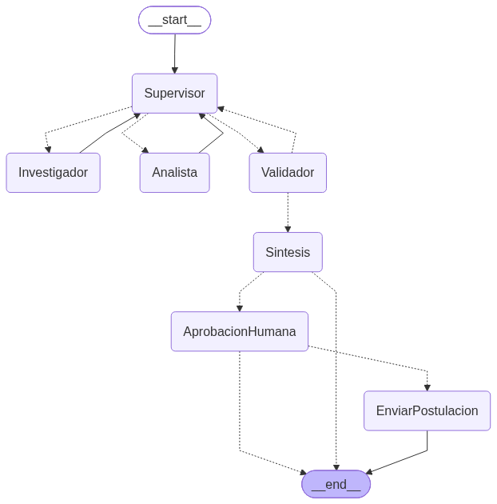
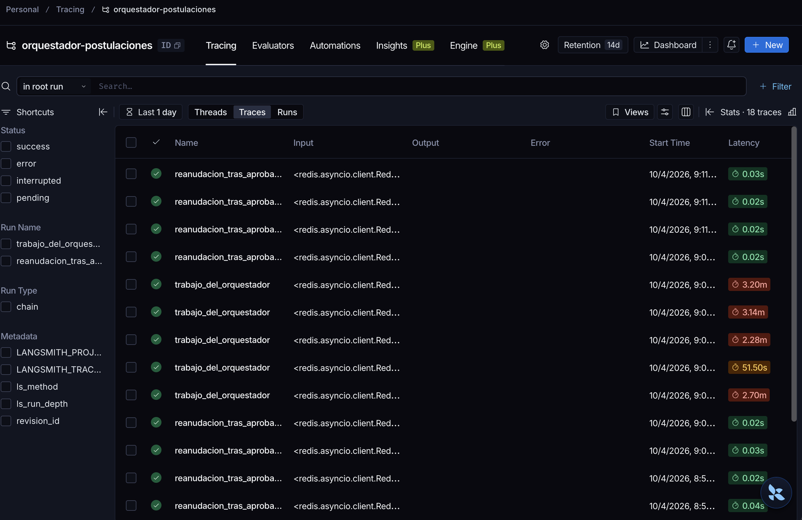
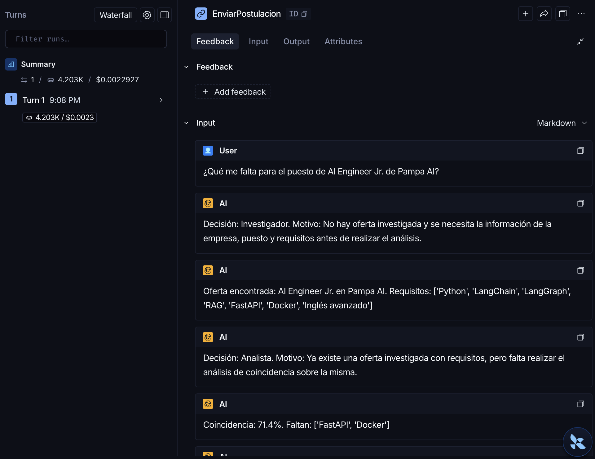
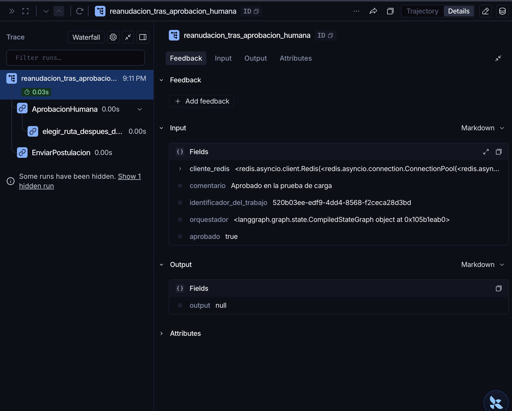
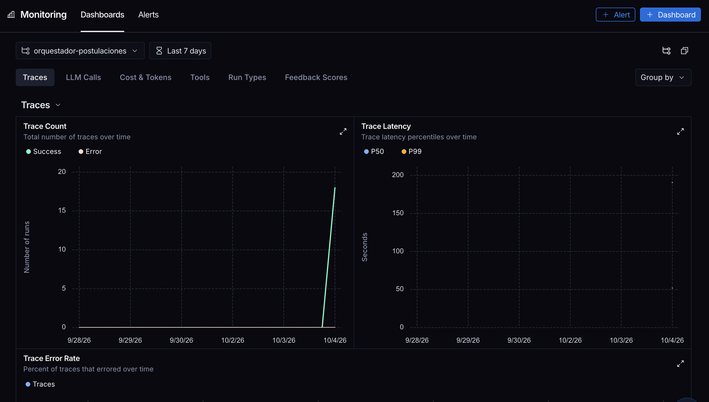

# Pre-entrega 7 · API de producción y monitoreo activo

API REST (**FastAPI**) que expone el orquestador multi-agente del Módulo 6 (evaluador de postulaciones laborales):
recibe la tarea, la **encola** y devuelve un `job_id` al instante; el trabajo corre en segundo plano, su estado y los
checkpoints de LangGraph viven en **Redis**, cada ejecución se traza en **LangSmith**, y antes de la única acción con
efectos externos (**enviar la postulación**) el grafo se **pausa hasta recibir aprobación humana**.



## Consigna (checklist oficial)

- [x] Endpoint asíncrono que encola y devuelve un `job_id` sin bloquear el event loop → `POST /tasks` (responde 202 en milisegundos)
- [x] Estado del job persistido en Redis, incluido el paso a `FAILED` ante una excepción → `worker.py`
- [x] Checkpoints de LangGraph en Redis → `AsyncRedisSaver`
- [x] Trazas visibles en el dashboard (LangSmith) con captura en `/screenshots`
- [x] Capturas del costo por ejecución y la latencia p95 de las 5 peticiones concurrentes en `/screenshots`
- [x] Nodo Human-in-the-loop que pausa la ejecución hasta recibir aprobación externa → `hitl.py` + `POST /tasks/{id}/approve`
- [x] README con pasos para inicializar Redis y la API, cómo lanzar las 5 peticiones concurrentes, y `requirements.txt`

## Estructura

```
pre-entrega-7/codigo/
├── app/
│   ├── main.py            # FastAPI: POST /tasks, GET /tasks/{id}, POST /tasks/{id}/approve, GET /health
│   ├── graph.py           # orquestador del M6 + nodos HITL + compilación con checkpointer de Redis
│   ├── worker.py          # corre el grafo en segundo plano y guarda PENDING/RUNNING/WAITING_APPROVAL/DONE/FAILED en Redis
│   ├── observability.py   # configuración de LangSmith (las funciones del worker usan @traceable)
│   ├── hitl.py            # detecta la acción crítica, interrupt() y reanudación con Command(resume=...)
│   ├── state.py, agents/, data/, proveedor_de_modelos.py   # el sistema multi-agente del Módulo 6
├── lanzar_5_peticiones_concurrentes.py   # prueba de carga: 5 tareas a la vez, aprueba las pausas, mide p50/p95
├── docker-compose.yml    # Redis con Docker (alternativa a brew)
├── requirements.txt
├── .env.example
└── screenshots/           # capturas del dashboard de LangSmith
```

## Estados de un trabajo

```
PENDING -> RUNNING -> WAITING_APPROVAL --(POST /approve)--> RUNNING -> DONE
                  \-> DONE (si no hay acción crítica)
cualquier excepción -> FAILED (con el error guardado en Redis, el cliente deja de esperar)
```

**¿Qué es "crítico"?** Si el perfil cumple ≥ 60% de los requisitos, el sistema propone **enviar la postulación**: es una
acción con efectos externos (no se puede deshacer), así que se pausa con `interrupt()` hasta que un humano apruebe o
rechace. Si se rechaza, termina sin enviar. Si la coincidencia es baja, no hay nada crítico que aprobar y termina en `DONE`.

## Cómo levantarlo (sin Docker)

1. **Redis** (la versión 8 ya incluye los módulos de búsqueda y JSON que necesita `AsyncRedisSaver`):
   ```bash
   brew install redis            # en Linux: apt install redis / o Redis Stack
   brew services start redis
   redis-cli ping                # -> PONG
   ```
   Con Docker, en vez de brew: `docker compose -f pre-entrega-7/codigo/docker-compose.yml up -d`
2. **LangSmith**: crear una cuenta gratis en [smith.langchain.com](https://smith.langchain.com) → Settings → API Keys.
3. **Variables**: copiar `.env.example` a la raíz del repo como `.env` y completar `GOOGLE_API_KEY` y `LANGSMITH_API_KEY`.
4. **Dependencias y API**:
   ```bash
   uv sync                                   # o: pip install -r pre-entrega-7/codigo/requirements.txt
   cd pre-entrega-7/codigo/app
   uv run uvicorn main:aplicacion --port 8000
   ```
   Documentación interactiva: http://localhost:8000/docs

## Probar a mano

```bash
curl -X POST localhost:8000/tasks -H 'content-type: application/json' \
     -d '{"pedido": "Quiero postularme al puesto de AI Engineer en Pampa AI. ¿Qué tanto encaja mi perfil?"}'
# -> {"job_id": "...", "estado": "PENDING"}

curl localhost:8000/tasks/<job_id>               # RUNNING ... WAITING_APPROVAL (con el pedido de aprobación)
curl -X POST localhost:8000/tasks/<job_id>/approve -H 'content-type: application/json' \
     -d '{"aprobado": true, "comentario": "Enviala"}'
curl localhost:8000/tasks/<job_id>               # DONE, postulacion_enviada: true
```

## Prueba de carga: 5 peticiones concurrentes

Con la API corriendo, en otra terminal:

```bash
uv run python pre-entrega-7/codigo/lanzar_5_peticiones_concurrentes.py
```

Lanza 5 tareas a la vez con `asyncio.gather`, consulta su estado, aprueba automáticamente las pausas HITL y al final
imprime la latencia de cada una con p50 y p95. Después, en LangSmith → proyecto `orquestador-postulaciones`:
- **Traces**: una traza por ejecución, con cada nodo del grafo (Supervisor, Investigador, Analista...) y sus tokens.
- **Monitor**: latencia **p95** y **costo** por traza (LangSmith lo calcula con los tokens de entrada y salida).

## Resultados de la prueba de carga (5 peticiones concurrentes)

Salida completa: [`salida_prueba_de_carga.txt`](salida_prueba_de_carga.txt). Capturas: [`screenshots/`](screenshots/).

| Métrica | Valor |
|---|---|
| Tiempo de respuesta de `POST /tasks` | ~0,15 s (encola y devuelve el `job_id`, no bloquea) |
| Trabajos completados | 5 de 5 en `DONE` (4 pasaron por la pausa de aprobación humana) |
| Latencia de punta a punta p50 / **p95** | 166 s / **196 s** |
| **Costo por ejecución** (calculado por LangSmith) | **~US$ 0,0023** (≈ 4.200 tokens, precio de lista de Gemini 3.5 Flash-Lite) |

### Capturas del dashboard (LangSmith)

| Captura | Qué muestra |
|---|---|
|  | **Trazas activas**: las 5 ejecuciones concurrentes (`trabajo_del_orquestador`) y sus reanudaciones tras la aprobación humana, con la latencia de cada una |
|  | **Costo por ejecución**: LangSmith calcula **US$ 0,0022927** a partir de 4.203 tokens de entrada y salida; a la derecha, las decisiones del Supervisor y los aportes de cada agente |
|  | **Human-in-the-loop**: la reanudación con `aprobado: true` pasa por `AprobacionHumana` y recién ahí ejecuta `EnviarPostulacion` |
|  | **Latencia** de las trazas (P50 y P99) |

> **Sobre el p95:** el gráfico de LangSmith muestra P50 y P99. Con 5 ejecuciones, el p95 y el p99 son la misma
> traza (la más lenta, ~196 s), que coincide con el **p95 = 195,9 s** medido por el script de carga.

### Lectura del dashboard: ¿dónde se va el tiempo y los tokens?

Promedios por nodo del grafo, sacados de las trazas de LangSmith:

| Nodo | Veces por ejecución | Segundos promedio | Tokens promedio | % del costo |
|---|---|---|---|---|
| **Investigador** | 1 | **76,5** | **1.850** | **38%** |
| Analista | 1 | 32,2 | 1.351 | 35% |
| Supervisor | 3 | 12,5 (cada vez) | 338 (cada vez) | 27% |
| Validador, Síntesis, Aprobación humana | 1 | ~0 | 0 | 0% (código, sin LLM) |

- **El Investigador es el cuello de botella**: hace varias llamadas al LLM (buscar oferta → leer oferta → respuesta estructurada).
- **La latencia está dominada por el límite de pedidos por minuto**: las 5 ejecuciones comparten un limitador de 12 pedidos/minuto
  (cuota gratuita de Gemini). Una sola ejecución sin competencia tarda ~60 s; con 5 a la vez, ~3 minutos.
- **Mejoras posibles**: un modelo con más cuota (plan pago), que el Investigador lea la oferta en una sola llamada, y
  validar y sintetizar con código (como ya se hace) en vez de con LLM.

## Decisiones de diseño (el "por qué")

- **Worker = `asyncio.create_task`** dentro del mismo proceso: simple y suficiente para esta etapa. Se guardan referencias
  a las tareas para que no las borre el recolector de basura. Para producción real: Arq o Celery en otro proceso.
- **Nada bloquea el event loop**: Redis con `redis.asyncio`, el grafo con `ainvoke`, el checkpointer async.
- **Dos usos de Redis**: hashes `trabajo:{job_id}` para el estado que consulta el cliente (con vencimiento de 24 h) y
  `AsyncRedisSaver` para los checkpoints del grafo (necesarios para pausar y reanudar el HITL).
- **El estado del grafo guarda dicts, no objetos Pydantic**: el checkpointer serializa a JSON; al leer se re-validan con
  Pydantic (`leer_oferta_investigada`). Sin esto, la reanudación después del HITL fallaba.
- **Límite de pedidos por minuto al LLM** (`PEDIDOS_POR_MINUTO_AL_LLM`): las 5 tareas comparten un limitador para no
  superar la cuota gratuita de Gemini; por eso la latencia de la prueba de carga incluye esperas.
- **LangSmith en lugar de Phoenix**: no requiere instalar nada (es un servicio web) y calcula costos solo.
