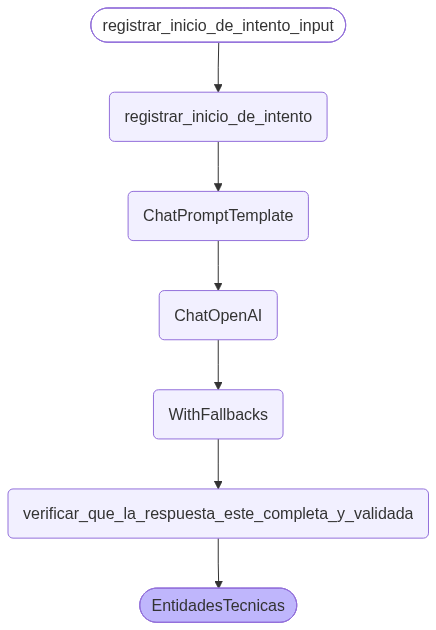
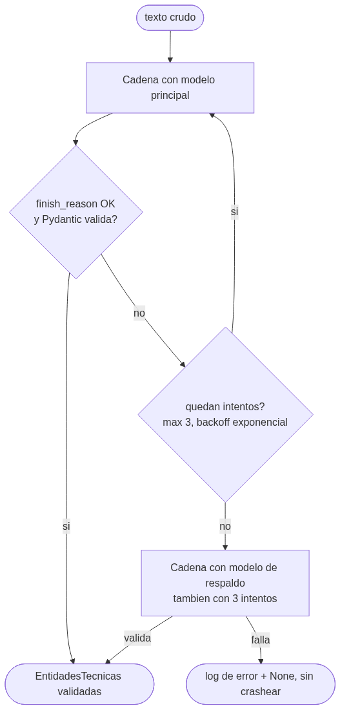

# Pre-entrega 2 · Pipeline de extracción de entidades técnicas

Texto crudo (un log de error o una descripción de arquitectura) → **objeto Pydantic validado** con
`tecnologias`, `nivel_de_criticidad` y `resumen_tecnico`.

Construido con **LangChain LCEL** + **Pydantic** + **async**, con reintentos, modelo de respaldo
y detección de respuestas truncadas (`finish_reason`).

## Consigna (resumen oficial)

Pipeline de Extracción de Entidades Técnicas: texto crudo (log de error o descripción de arquitectura) → objeto validado.

- [x] `schemas.py` con modelo Pydantic: `tecnologias` (lista), `nivel_de_criticidad` (enum baja/media/alta), `resumen_tecnico`
- [x] `ChatPromptTemplate` modular que acepta el texto y las instrucciones de formato (sin f-strings)
- [x] Cadena LCEL `prompt | model.with_structured_output(Schema)`
- [x] `.with_retry()` ante JSON mal formado o incompleto (y detección de `finish_reason`)
- [x] Función async `process_text(text: str)` con `.ainvoke()` y logs de validación y reintentos
- [x] Mini-script de prueba async (`main.py`) con prueba de estrés (texto ambiguo)

## Cómo fluye un texto





## Estructura

| Archivo | Qué contiene |
|---|---|
| `schemas.py` | `NivelDeCriticidad` (Enum baja/media/alta) y `EntidadesTecnicas` (modelo Pydantic con validador: la lista de tecnologías no puede quedar vacía, se limpian espacios y duplicados) |
| `chain.py` | `ChatPromptTemplate` (roles system + human, variables `{texto}` e `{instrucciones_de_formato}`), modelo de chat (Gemini por defecto) con `temperature=0`, cadena LCEL `prompt \| modelo.with_structured_output(EntidadesTecnicas)`, `.with_retry()`, `.with_fallbacks()` y la función async `process_text()` |
| `proveedor_de_modelos.py` | Elige el proveedor con `PROVEEDOR_LLM` en `.env`: **gemini** (por defecto), openai o anthropic. El resto del código no cambia |
| `main.py` | Script de prueba async (4 escenarios, ver abajo). Guarda los logs en `evidencia_de_ejecucion.log` |
| `generar_diagrama.py` | Genera los dos diagramas PNG con `get_graph().draw_mermaid_png()` |

> La función pedida por la consigna es `process_text(text: str)` (en `chain.py`). Llama a
> `extraer_entidades_tecnicas_desde_texto`, que ejecuta la cadena con `await cadena.ainvoke(...)`.

## Ejemplo de salida

Entrada: *"Nuestra API en FastAPI está devolviendo timeouts intermitentes. El caché en Redis se satura
en picos de tráfico y las conexiones a PostgreSQL se agotan [...] Esto está afectando a usuarios en producción."*

```json
{
  "tecnologias": ["FastAPI", "Redis", "PostgreSQL"],
  "nivel_de_criticidad": "alta",
  "resumen_tecnico": "API en FastAPI con timeouts por saturación de Redis y agotamiento del pool de conexiones de PostgreSQL, afectando producción."
}
```

## Setup

Desde la raíz del repo (usa `uv`):

```bash
uv sync
cp semana-2/entrega-2/.env.example .env   # y completá OPENAI_API_KEY
```

O con pip: `pip install -r requirements.txt`.

| Variable | Para qué |
|---|---|
| `PROVEEDOR_LLM` | `gemini` (por defecto), `openai` o `anthropic` |
| `GOOGLE_API_KEY` / `OPENAI_API_KEY` / `ANTHROPIC_API_KEY` | La key del proveedor elegido (nunca se commitea) |
| `MODELO_PRINCIPAL` / `MODELO_DE_RESPALDO` | Opcional. Por defecto en Gemini: `gemini-flash-lite-latest` y `gemini-2.5-flash-lite` (modelos "lite": más cuota gratuita por día) |

## Ejecutar

```bash
uv run python semana-2/entrega-2/main.py
uv run python semana-2/entrega-2/generar_diagrama.py   # opcional, regenera los PNG
```

## Escenarios de la prueba

1. **Validador Pydantic** sin llamar al modelo: una lista de tecnologías vacía es rechazada; los duplicados se limpian.
2. **Dos textos limpios en paralelo** con `asyncio.gather` (un log de producción y la arquitectura de Sirius, un detector de estafas).
3. **Prueba de estrés**: un texto ambiguo sin tecnologías claras. O el modelo se recupera, o el validador rechaza y se reintenta; el programa nunca crashea.
4. **Respuesta truncada**: el modelo principal tiene solo 15 tokens → `finish_reason=MAX_TOKENS` (o `length` en OpenAI) → se detecta, se reintenta 3 veces y el **modelo de respaldo** rescata la respuesta.

## Decisiones de diseño (el "por qué")

- **`with_structured_output(..., include_raw=True)`**: además del objeto parseado, devuelve el mensaje crudo. Así se puede leer `finish_reason` y detectar respuestas cortadas *antes* de usar el objeto.
- **El paso `verificar_que_la_respuesta_este_completa_y_validada` lanza una excepción** si la respuesta está truncada o no cumple el esquema. Esa excepción es la que dispara `.with_retry()`.
- **Solo se reintentan errores que pueden arreglarse reintentando** (truncado, mal formado, rate limit, conexión, timeout). Un error de autenticación no se reintenta: reintentarlo 3 veces no lo arregla.
- **Dos niveles de reintento**: los errores de red o de cuota (429) los reintenta el SDK del proveedor (`max_retries=2`); los errores de **formato** (respuesta truncada o que no cumple el esquema) los reintenta la cadena con `.with_retry()` y quedan en los logs.
- **Proveedor intercambiable**: misma idea del Módulo 1. Cambiar de Gemini a OpenAI o Anthropic es cambiar una línea del `.env`.
- **`temperature=0`**: para extraer datos queremos respuestas estables, no creatividad.
- **`timeout=30`**: ninguna llamada puede quedar colgada para siempre.
- **Sin f-strings en la cadena**: el prompt es un `ChatPromptTemplate`; las instrucciones de formato entran como variable con `.partial()`.

## Evidencia de ejecución

Ver [`evidencia_de_ejecucion.log`](evidencia_de_ejecucion.log).
