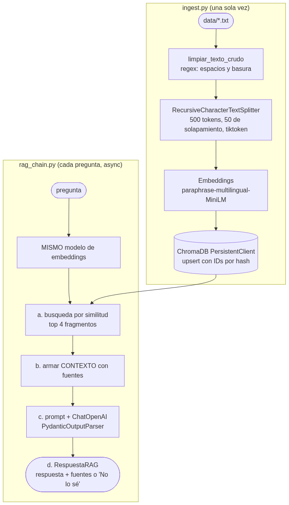
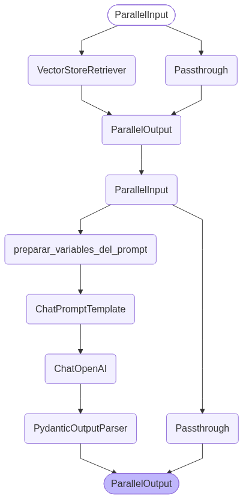

# Pre-entrega 3 · Sistema de recuperación semántica local (RAG con ChromaDB)

Pregunta → buscar los fragmentos relevantes en una **base vectorial local persistente** →
responder **solo** con esa información → objeto Pydantic con **respuesta + fuentes**.
Si la respuesta no está en los documentos, el sistema responde **"No lo sé"**.

**Dominio:** asistente para docentes de una escuela secundaria que consulta qué **adecuaciones pedagógicas**
necesita cada estudiante (dislexia → letra grande, TDAH → consignas de a una, tiempo extra, etc.).
**Todos los datos son ficticios.**





## Estructura

| Archivo | Qué hace |
|---|---|
| `data/` | 4 archivos `.txt` ficticios: protocolo de adecuaciones + fichas de 3° A, 4° B y 5° C |
| `configuracion.py` | Rutas, nombre de la colección, tamaño de fragmentos, top_k y **el único modelo de embeddings** que usan ingesta y consulta |
| `ingest.py` | Limpia (regex) → fragmenta por **tokens** (500 / 50 de solapamiento, `tiktoken`) → `upsert` en ChromaDB `PersistentClient` (carpeta `./vectorstore`) con **IDs determinísticos** (`archivo::índice::hash`) y metadatos (`fuente`, `indice_del_fragmento`). Si la colección ya existe, **no reindexa** |
| `schemas.py` | `RespuestaGeneradaPorElModelo` (lo que genera el LLM) y `RespuestaRAG` (respuesta + `fuentes` + cantidad de fragmentos) |
| `rag_chain.py` | Cadena LCEL completa: `retriever` → contexto → `ChatPromptTemplate` → `ChatOpenAI` → `PydanticOutputParser` (con `.with_retry()`), y la función async `get_rag_response(query)` |
| `main.py` | Pruebas: *"¿Qué adecuaciones aplico en el examen de Historia de Tomás Ferreyra?"* (está en los documentos) y la **pregunta trampa** *"¿Qué nota sacó Tomás en Matemática?"* (las notas no están). Guarda `evidencia_de_ejecucion.log` |
| `generar_diagrama.py` | Genera el diagrama PNG |

> `get_rag_response(query)` (en `rag_chain.py`) llama a `responder_pregunta_usando_solo_documentos_locales`, que hace los 4 pasos pedidos:
> **(a)** búsqueda por similitud en Chroma, **(b)** arma el contexto con los fragmentos,
> **(c)** llama al LLM con `await cadena.ainvoke()`, **(d)** parsea con `PydanticOutputParser` y devuelve un `RespuestaRAG` con texto y referencias.

## Setup y ejecución

Desde la raíz del repo:

```bash
uv sync                                      # o: pip install -r requirements.txt
cp semana-3/entrega-3/.env.example .env      # completar OPENAI_API_KEY
uv run python semana-3/entrega-3/ingest.py   # indexa (la 2da vez detecta que ya existe)
uv run python semana-3/entrega-3/main.py     # corre las dos pruebas
```

`uv run python semana-3/entrega-3/ingest.py --reindexar` fuerza volver a indexar
(gracias a los IDs determinísticos, el `upsert` reemplaza en vez de duplicar).

## Decisiones de diseño (el "por qué")

- **Fragmentos medidos en tokens, no en caracteres**: el límite del modelo se mide en tokens.
  500 caracteres pueden ser 90 o 160 tokens según el idioma.
- **Un solo modelo de embeddings, definido en un solo lugar** (`configuracion.py`): si se indexa con un
  modelo y se consulta con otro, los vectores viven en "espacios" distintos y la búsqueda devuelve basura.
- **Modelo de embeddings multilingüe y local** (`paraphrase-multilingual-MiniLM-L12-v2`): los documentos están
  en español y no requiere API key ni tiene costo.
- **`PydanticOutputParser` + `.with_retry()`**: si el modelo devuelve un JSON mal formado, el parser lanza un error y la cadena reintenta (hasta 3 veces).
- **`upsert` con IDs por hash del contenido**: correr la ingesta dos veces no duplica fragmentos;
  si un documento cambia, cambia su ID.
- **top_k = 4**: suficiente contexto sin "perderse en el medio" ni gastar tokens de más.
- **Las fuentes las arma el código, no el LLM**: salen de los metadatos reales de los fragmentos
  recuperados, así el modelo no puede inventar referencias. Si la respuesta es "No lo sé", la lista de fuentes queda vacía.
- **`temperature=0` + reglas estrictas en el system prompt**: menos creatividad, menos alucinación.

## Evidencia de ejecución

Ver [`evidencia_de_ejecucion.log`](evidencia_de_ejecucion.log): la prueba 1 responde con fuentes,
la prueba trampa responde "No lo sé" con `fuentes: []`.
