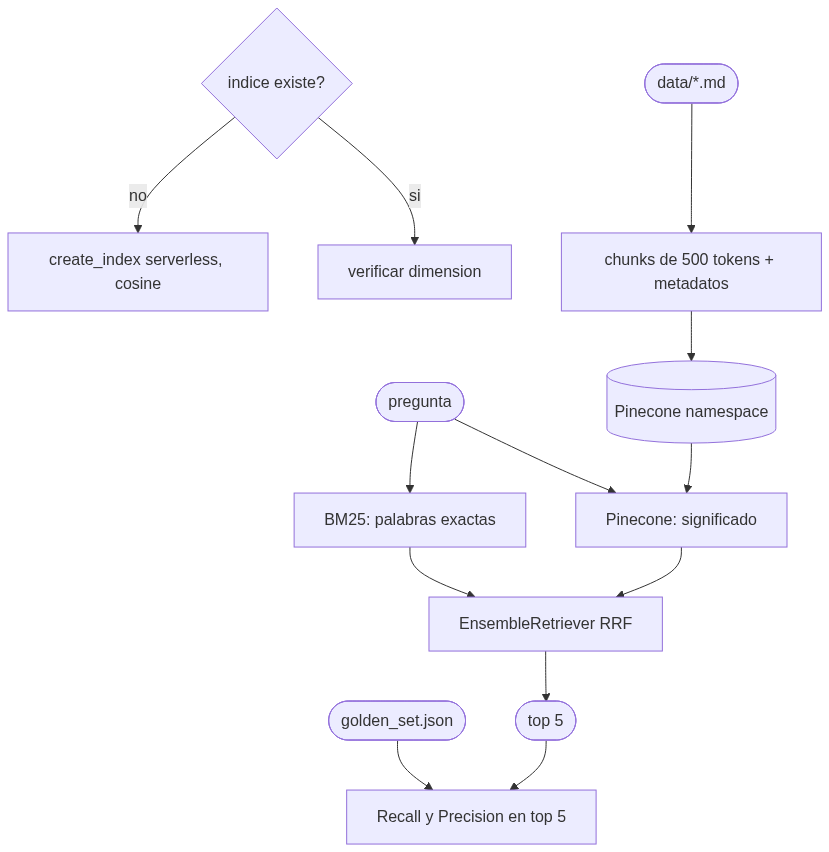

# Pre-entrega 4 · Sistema RAG escalable en la nube con Pinecone

Módulo de recuperación para un **asistente del Manual IB del colegio** (monografía/EE, TOK, CAS,
evaluación interna/IA y reglamento de exámenes). Los documentos son **resúmenes ficticios** con
fines educativos, no documentos oficiales del IB.

Búsqueda **híbrida**: BM25 (palabras exactas como *TOK*, *RPPF*, *CAS*) + vectores en **Pinecone
Serverless** (significado), fusionadas con `EnsembleRetriever`. Se mide con **Recall@5** y **Precision@5**.



## Consigna (resumen oficial)

- [x] `.env` con `PINECONE_API_KEY`, la key del LLM e `INDEX_NAME`
- [x] Script de inicialización: verifica si el índice existe y lo crea en modo Serverless → `inicializar_indice.py`
- [x] Ingesta: documentos técnicos (Markdown) → `RecursiveCharacterTextSplitter` → embeddings → Pinecone, con el **texto y la fuente en la metadata** + página y etiquetas de categoría → `ingest.py`
- [x] Clase `RAGSystem` que encapsula un `EnsembleRetriever` (BM25 + Pinecone) y devuelve el top 5 → `rag_system.py`
- [x] `evaluate.py` con un benchmark de preguntas con documento fuente conocido (`golden_set.json`), Recall@5 y Precision@5, reporte en consola
- [x] Namespaces, dimensión del índice = dimensión del modelo, chunks de ~500 tokens

## Estructura

| Archivo | Qué hace |
|---|---|
| `data/` | 5 documentos Markdown del manual (ficticios) |
| `configuracion.py` | Nombre del índice, namespace, región, modelo de embeddings, tamaño de chunks, pesos del híbrido |
| `schemas.py` | `MetadatosDelFragmento` (esquema estricto de metadata, mismas claves en todos los vectores), `CasoDelGoldenSet`, `ResultadoDeUnaPregunta` |
| `inicializar_indice.py` | Crea el índice serverless si no existe (aws, us-east-1, cosine), verifica la dimensión y espera a que esté listo |
| `ingest.py` | Limpia, fragmenta, valida metadata con Pydantic y hace upsert en lotes de 100 con IDs determinísticos |
| `rag_system.py` | `RAGSystem`: BM25 + Pinecone + `EnsembleRetriever`, métodos async |
| `golden_set.json` | 6 preguntas con `documento_id_esperado` |
| `evaluate.py` | Calcula Recall@5 y Precision@5 para BM25 solo, Pinecone solo e híbrido; imprime el reporte y lo guarda en `resultado_de_la_evaluacion.json` |

## Cómo replicar el índice de Pinecone (paso a paso)

1. Entrá a [app.pinecone.io](https://app.pinecone.io) (plan gratuito) → **API Keys** → **Create API key**. Copiala.
2. En la raíz del repo, en `.env`, agregá:
   ```
   PINECONE_API_KEY=tu-key
   INDEX_NAME=manual-ib
   ```
   No hace falta crear el índice a mano: el script lo crea.
3. Instalá dependencias y corré los 3 scripts en orden:
   ```bash
   uv sync                                                  # o: pip install -r requirements.txt
   uv run python semana-4/entrega-4/inicializar_indice.py   # crea el índice (dimensión 384)
   uv run python semana-4/entrega-4/ingest.py               # sube los fragmentos al namespace
   uv run python semana-4/entrega-4/evaluate.py             # imprime Recall@5 y Precision@5
   ```
4. En la consola de Pinecone vas a ver el índice `manual-ib` con el namespace `manual-ib-colegio` y sus vectores.

`ingest.py --reindexar` fuerza volver a subir (los IDs determinísticos hacen que el upsert reemplace, no duplique).

## Decisiones de diseño (el "por qué")

- **Embeddings locales multilingües** (`paraphrase-multilingual-MiniLM-L12-v2`, 384 dimensiones): gratis, sin API key y buenos en español.
  La consigna menciona 1536 porque es la dimensión de OpenAI `text-embedding-3-small`; acá **la dimensión se calcula del modelo** y
  `inicializar_indice.py` frena si el índice existente tiene otra. Así es imposible el *mismatch de dimensiones*.
- **Texto original dentro de la metadata**: `PineconeVectorStore` lo guarda en `metadata["text"]`; una sola consulta trae vector + texto + fuente.
- **Esquema de metadata estricto con Pydantic**: todos los vectores tienen las mismas claves (`documento_id`, `fuente`, `categoria`,
  `etiquetas`, `pagina`, `seccion`, `indice_del_fragmento`). Evita el *schema drift*. Como Markdown no tiene páginas,
  `pagina` = número de sección donde empieza el fragmento.
- **Namespace** (`manual-ib-colegio`): aísla estos datos. Mañana se puede sumar otro namespace (por ejemplo, otro colegio) en el mismo índice.
- **Chunks de 500 tokens con 75 de solapamiento**: el piso del rango sugerido; los documentos son cortos y así cada uno se divide en 2.
- **Fusión por ranking, no por puntaje**: BM25 y la similitud coseno están en escalas distintas. `EnsembleRetriever` usa
  *Reciprocal Rank Fusion* (mira la **posición** de cada resultado), con pesos 0.5 / 0.5.
- **BM25 sin tildes y en minúsculas**: "monografía" y "monografia" cuentan como la misma palabra.

## Cómo leer las métricas

- **Recall@5**: ¿el documento correcto aparece entre los 5 resultados? (1 o 0 por pregunta, porque hay un solo documento esperado).
- **Precision@5**: ¿qué porcentaje de los 5 resultados viene del documento correcto? Cada documento tiene **2 fragmentos**, así que el
  **máximo posible es 2/5 = 40%**. Una Precision@5 de 40% es perfecta para este dataset.

## Resultados (ejecución real contra Pinecone)

| Estrategia | Recall@5 | Precision@5 |
|---|---|---|
| Solo palabras clave (BM25) | 100% | 37% |
| Solo significado (Pinecone) | 100% | 33% |
| **Híbrido (EnsembleRetriever)** | **100%** | **40%** (el máximo posible: 2 fragmentos por documento) |

**Lectura:** las tres estrategias encuentran siempre el documento correcto (Recall@5 = 100%), pero el híbrido trae
**menos ruido**: en todas las preguntas los 2 fragmentos del documento correcto quedan dentro del top 5. Por ejemplo,
en *"¿Qué es el RPPF?"* el vectorial solo trajo 1 fragmento de la monografía, y BM25 (que reconoce la sigla exacta
"RPPF") ayudó al híbrido a traer los 2.

Detalle completo: [`salida_de_la_evaluacion.txt`](salida_de_la_evaluacion.txt) y [`resultado_de_la_evaluacion.json`](resultado_de_la_evaluacion.json).
