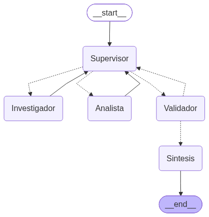

# Pre-entrega 6 · Orquestador multi-agente especializado

Equipo de agentes que evalúa una **postulación laboral**: un **Investigador** encuentra la oferta y extrae sus
requisitos, un **Analista** los compara con el perfil del candidato y calcula el % de coincidencia, y un
**Supervisor** decide quién trabaja en cada momento y cuándo terminar. Datos ficticios en `data/`.



**Demo del flujo de delegación:** [`demo_delegacion.ipynb`](demo_delegacion.ipynb) (ejecutado, con salidas) ·
traza en [`traza_de_delegacion.log`](traza_de_delegacion.log) y [`traza_de_delegacion.json`](traza_de_delegacion.json).

```
START -> Supervisor -> Investigador -> Supervisor -> Analista -> Supervisor -> Validador -> Sintesis -> END
```

## Consigna (checklist oficial)

- [x] `state.py` con el estado compartido: `EstadoDelOrquestador(MessagesState)` con `siguiente_agente`, `tarea_completada`, `pasos`, una clave propia por agente y el registro `contribuciones` (quién aportó qué)
- [x] `agents/research_agent.py` (Investigador) y `agents/analyst_agent.py` (Analista), cada uno con `create_agent` y **herramientas acotadas**
- [x] `graph.py` con `StateGraph`, nodo **Supervisor** que decide con salida estructurada `Literal["Investigador", "Analista", "FINALIZAR"]`, mapeada a nodos con `add_conditional_edges`
- [x] Validación antes de `END`: nodo **Validador** determinístico + rúbrica en el prompt del Supervisor
- [x] Herramientas funcionales: búsqueda de ofertas (búsqueda simulada sobre archivos locales) y comparación con el perfil
- [x] README con diagrama del grafo (`get_graph().draw_mermaid_png()`), topología y manejo de conflictos
- [x] Notebook demostrando la delegación

## Estructura

| Archivo | Qué hace |
|---|---|
| `state.py` | `EstadoDelOrquestador` + modelos Pydantic `OfertaInvestigada` y `AnalisisDeCoincidencia` (lo que entra al estado está validado) |
| `agents/research_agent.py` | Investigador. Herramientas: `buscar_ofertas_de_trabajo`, `leer_oferta_completa`. Escribe **solo** `oferta_investigada` |
| `agents/analyst_agent.py` | Analista. Herramienta: `comparar_requisitos_con_el_perfil` (cálculo determinístico). Escribe **solo** `analisis_de_coincidencia` |
| `graph.py` | Supervisor, Validador, Síntesis y las aristas |
| `main.py` | Corre el pedido de prueba y guarda la traza |
| `demo_delegacion.ipynb` | Demo ejecutada del flujo |
| `data/ofertas/*.md`, `data/perfil_del_candidato.json` | Ofertas y perfil ficticios |

## Cómo ejecutar

```bash
uv sync                                       # o: pip install -r requirements.txt
cp semana-6/entrega-6/.env.example .env       # completar GOOGLE_API_KEY
uv run python semana-6/entrega-6/main.py
```

## ¿Por qué esta topología? (jerárquica, no colaborativa)

- **Jerárquica (Supervisor + especialistas)**: el orden del trabajo es claro (primero hay que *tener* la oferta, después
  *analizarla*), y un único coordinador hace fácil auditar quién decidió qué. Cada decisión queda en el log con su motivo.
- **Colaborativa (agentes que se hablan entre sí)** sería más flexible, pero más difícil de controlar: más riesgo de
  bucles y de que un agente pise el trabajo de otro.
- **El Supervisor no hace el trabajo de los especialistas**: solo recibe un resumen del estado y devuelve una decisión estructurada.

## ¿Cómo se manejan los conflictos y errores?

1. **Cada agente escribe en su propia clave** (`oferta_investigada`, `analisis_de_coincidencia`): nadie pisa el trabajo de otro.
   `contribuciones` usa el reducer `operator.add`, así que se acumula (historial de quién aportó qué).
2. **Datos validados con Pydantic** antes de entrar al estado (`response_format` en `create_agent`).
3. **Validador determinístico** (código, no juicio del LLM): verifica que exista la oferta, que todos sus requisitos estén
   clasificados como cumplidos o faltantes, y que el porcentaje coincida con la cuenta real.
4. **Bucle de reparación**: si el Validador encuentra errores, vuelve al Supervisor con el **error específico**, que se
   reenvía al especialista responsable para que lo corrija.
5. **Condición de parada**: máximo 6 pasos de especialistas (`CANTIDAD_MAXIMA_DE_PASOS_DE_ESPECIALISTAS`) + `recursion_limit=25`.
   Si se agotan con errores pendientes, se **escala a revisión humana** en la respuesta final en vez de seguir girando.
6. **Contexto mínimo**: el Investigador recibe solo el pedido del usuario; el Analista recibe solo la oferta estructurada.
   Ninguno ve el historial completo (evita la contaminación de contexto).
